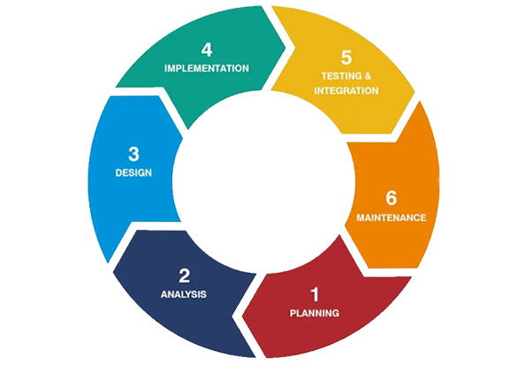

# Software Development Life Cycle (SDLC)

The **Software Development Life Cycle (SDLC)** outlines the systematic approach to developing software, ensuring a high-quality product is delivered efficiently. Below is a step-by-step breakdown of SDLC phases, the people involved, and the tasks performed in each stage.

---

## **1. Planning / Analyze**
The initial phase involves defining the scope, goals, and feasibility of the software project. This phase lays the foundation for the rest of the development process.
**Who Does This:**
- Product Owner
- Project Manager
- Business Analyst

**What We Produce:**
- **Product Requirements Document (PRD):** High-level overview of the product's goals.
- **Business Requirements Document (BRD):** Detailed business requirements and objectives.
- **Software Requirements Specification (SRS):** Technical documentation of system behavior.
- **Functional Requirements Document (FRD):** Functionalities and features required in the software.

---

## **2. Design**
**Who Does This:**
- System Architect
- UI/UX Designer

**What We Produce:**
- **System Design:** Overall architecture of the software.
- **High-Level Design Document (HLD):** Overview of modules, components, and interactions.
- **Low-Level Design Document (LLD):** Detailed design for each component.
- **Database Schema:** Structure of the database.

---

## **3. Development**
**Who Does This:**
- Frontend Developer
- Backend Developer
- Fullstack Developer

**What We Produce:**
- **Frontend Development:** UI implementation.
- **Backend Development:** Server-side logic.
- **API Integration:** Connecting frontend and backend functionalities.
- **Database Schema:** Implementation of database structure.

---

## **4. Testing**
**Who Does This:**
- Solution Architect
- QA Engineer
- Tester

**What We Produce:**
- **Test Plan:** Strategy for testing the application.
- **Test Cases:** Scenarios to validate software functionality.
- **Test Scripts:** Automation scripts for testing.
- **Defects Report:** List of identified bugs or issues.

---

## **5. Deployment**
**Who Does This:**
- Database Administrator
- DevOps Engineer

**What We Produce:**
- **Release Notes:** Summary of the deployed version.
- **Installation Guides:** Steps for installing the software.
- **Configuration Guides:** Documentation for setting up the environment.

---

## **6. Maintenance**
**Who Does This:**
- Support Engineer
- Tester
- Developer

**What We Produce:**
- **Change Requests:** Enhancements or modifications.
- **Bug Reports:** Documentation of identified bugs.
- **Patch Releases:** Quick fixes or updates.

---

## Starting SDLC for a Small or Personal Project

For smaller or personal projects, SDLC can be simplified as follows:

### Backend
1. **Requirement Analysis**: Identify the features and functionality.
2. **ER Diagram**: Define the database structure.
3. **API Endpoints**: Plan backend endpoints for the application.

### Wireframe
- Create a basic visual representation of the UI/UX.

---

By following this structured approach, even small projects can achieve clarity and quality during development.
